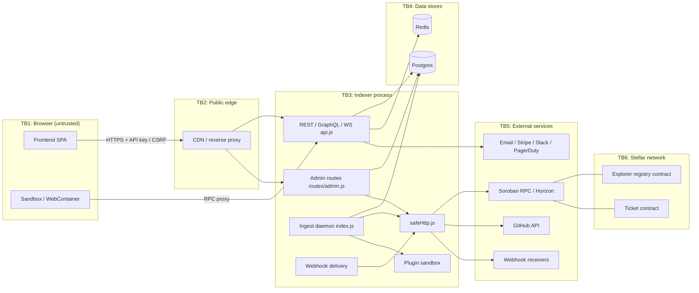
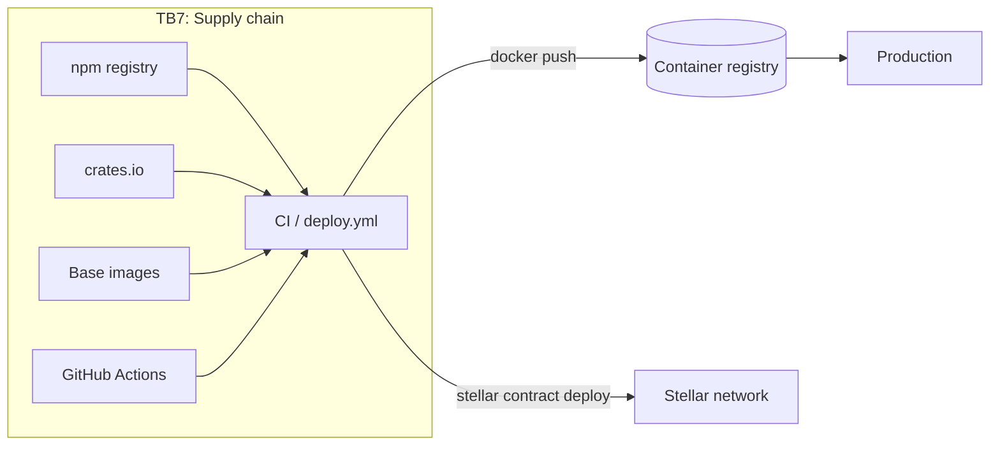

# Threat Model (STRIDE)

Living document for the Soroban Smart Block Explorer. Update it in the same PR
as any change that adds or moves a trust boundary (see the checklist in
`.github/pull_request_template.md`). Diagrams are Mermaid so they are reviewed
as code.

- **Status:** draft — requires review by two maintainers before it is considered accepted.
- **Rating:** Likelihood (L) and Impact (I) are scored 1–3; **Risk = L × I**
  (1–2 Low, 3–4 Medium, 6–9 High).
- **Status column:** ✅ mitigated (code link) · ⚠️ partial · ❌ open (needs a
  tracked issue labelled `security`).

## 1. Assets

| Asset | Where it lives |
|---|---|
| API keys (hashed) and scopes | Postgres, `indexer/src/auth/` |
| Admin secret / TOTP seeds | Env vars, `indexer/src/admin/` |
| Webhook signing secrets | Postgres (`webhooks`), `indexer/src/webhookDelivery.js` |
| Contract admin / deployer signing keys | Operator key store, CI secrets |
| User emails (alerts, billing) | Postgres, `indexer/src/emailService.js`, Stripe |
| Integrity of indexed data (events, ABIs, decoded calls) | Postgres, explorer contract registry |
| Availability of API / indexer | Infra |
| CI/CD credentials (registry, deploy) | GitHub Actions secrets |

## 2. Actors

Anonymous visitor · API-key holder · Admin operator · Plugin author · Webhook
receiver (third party) · Soroban RPC / Horizon provider · GitHub (ABI source) ·
Contract registrant (on-chain) · Supply-chain publisher (npm, crates, images,
Actions) · Shared-sandbox collaborator.

## 3. Data flow and trust boundaries

## 4. Threats

| # | Element | STRIDE | Threat | L | I | Risk | Mitigation / tracking | Status |
|---|---|---|---|---|---|---|---|---|
| T01 | API | S | Stolen or guessed API key used to impersonate a client | 2 | 2 | 4 | Hashed keys, scopes, rotation — `indexer/src/auth/apiKeyAuth.js`, `admin/keyManager.js` | ✅ |
| T02 | Admin | S | Admin secret brute force | 2 | 3 | 6 | TOTP + IP allow-list — `admin/adminAuth.js`, `admin/totp.js`, `admin/ipUtils.js` | ✅ |
| T03 | Admin | S | Spoofed `X-Forwarded-For` bypasses admin IP allow-list | 2 | 3 | 6 | `trust proxy` must be pinned to the real proxy hop count; verify in `admin/ipUtils.js` | ⚠️ |
| T04 | Browser | S | CSRF on cookie-authenticated mutations | 2 | 2 | 4 | `indexer/src/csrf.js` | ✅ |
| T05 | Webhooks | S | Receiver cannot tell genuine deliveries from forged ones | 2 | 2 | 4 | HMAC `X-Webhook-Signature` — `webhookDelivery.js` | ✅ |
| T06 | Webhooks | S | Replay of a captured signed delivery | 2 | 2 | 4 | Add signed timestamp + tolerance window to the signature | ❌ |
| T07 | RPC | S | Malicious / compromised RPC provider serves forged events | 1 | 3 | 3 | Multi-node cross-check — `rpcVerifier.js`, `rpcMultiNode.js`, `integrityReconciler.js` | ✅ |
| T08 | Collab sandbox | S | Leaked edit link lets a stranger join a shared session | 2 | 2 | 4 | Link tokens with view/edit roles, owner rotate + kick — `indexer/src/collab/` (#926) | ✅ |
| T09 | Ingest | T | Chain reorg / rollback leaves stale events | 2 | 2 | 4 | `reorgWorker.js` | ✅ |
| T10 | ABI registry | T | Attacker registers a misleading ABI for someone else's contract | 2 | 3 | 6 | `caller` must match `registered_by` in `contracts/explorer`; source verification — `sourceVerification.js` | ✅ |
| T11 | ABI import | T | Malicious JSON from GitHub import poisons decoded output | 2 | 2 | 4 | Schema validation + host allow-list — `routes/admin.js`, `contractRegistry.schema.json`, `safeHttp.js` | ✅ |
| T12 | DB | T | SQL injection via filters / query params | 1 | 3 | 3 | Parameterised queries; `test/security/sql-injection.test.js` | ✅ |
| T13 | GraphQL | T | Injection through dynamic GraphQL filters | 1 | 3 | 3 | Schema-typed args — `graphql.js` | ✅ |
| T14 | Plugins | T | Plugin mutates host state or DB | 2 | 3 | 6 | Worker sandbox — `plugins/sandbox.js`, `sandboxWorker.js` | ⚠️ |
| T15 | Frontend | T | Stored XSS via contract names / descriptions / decoded strings | 2 | 3 | 6 | React escaping; CSP via `helmet` in `api.js`; audit `dangerouslySetInnerHTML` use | ⚠️ |
| T16 | Data | T | Direct DB tampering by an insider bypasses audit | 1 | 3 | 3 | Audit log — `indexer/src/audit/`, MMR — `mmr.js` | ✅ |
| T17 | Supply chain | T | Compromised npm dependency executes in CI / runtime | 2 | 3 | 6 | Lockfiles, dependabot, `npm ci`; add `--ignore-scripts` + provenance checks | ⚠️ |
| T18 | Supply chain | T | Compromised crate in contracts build | 1 | 3 | 3 | `deny.toml` (cargo-deny), `Cargo.lock` | ✅ |
| T19 | Supply chain | T | Mutable base image tag swapped upstream | 2 | 3 | 6 | Pin base images by digest in Dockerfiles | ❌ |
| T20 | Supply chain | T | Third-party GitHub Action tag moved to malicious commit | 2 | 3 | 6 | Pin all actions to commit SHAs in `.github/workflows/` | ❌ |
| T21 | Contracts | T | Unauthorised upgrade of explorer contract WASM | 1 | 3 | 3 | Admin-gated upgrade; `upgradeDetector.js` alerts on upgrades | ✅ |
| T22 | Collab sandbox | T | Malicious peer injects content into a shared document | 2 | 1 | 2 | Edit role required to send updates; view role is read-only — `collab/` | ✅ |
| T23 | API | R | Admin denies performing a destructive action | 2 | 2 | 4 | Admin audit log — `indexer/src/audit/` | ✅ |
| T24 | Webhooks | R | Dispute over whether a delivery was sent | 2 | 1 | 2 | `webhook_deliveries` log | ✅ |
| T25 | Registry | R | Registrant denies registering an ABI | 1 | 1 | 1 | On-chain `registered_by` with `require_auth` | ✅ |
| T26 | API | I | Error responses leak stack traces / SQL | 2 | 2 | 4 | Central error handler; Sentry scrubbing — `sentry.js` | ⚠️ |
| T27 | Logs | I | API keys / emails written to logs | 2 | 2 | 4 | Logger redaction — `logger.js`; secret scanning — `docs/secret-scanning.md` | ⚠️ |
| T28 | Outbound HTTP | I | SSRF to cloud metadata / internal services via webhook, ABI import, stellar.toml URLs | 3 | 3 | 9 | `indexer/src/safeHttp.js` (IP deny-list, DNS pinning, no redirects, limits), lint rule, `deploy/k8s/indexer-egress-networkpolicy.yaml` (#928) | ✅ |
| T29 | Outbound HTTP | I | DNS rebinding bypasses SSRF check | 2 | 3 | 6 | Resolve once + pinned connect — `safeHttp.js`; `test/security/ssrf.test.js` | ✅ |
| T30 | API | I | Batch endpoint uses client `Host` header as fetch target | 2 | 3 | 6 | Loopback-only dispatch + relative-path check — `api.js` (#928) | ✅ |
| T31 | CORS | I | Overly permissive CORS exposes authenticated responses | 2 | 2 | 4 | `cors` allow-list; `test/cors.test.js` | ✅ |
| T32 | DB | I | Postgres reachable from outside the private network | 1 | 3 | 3 | Compose network isolation; no published DB port in production | ⚠️ |
| T33 | Billing | I | Stripe webhook endpoint accepts unsigned events | 1 | 3 | 3 | Stripe signature verification — `indexer/src/billing/` | ✅ |
| T34 | CI | I | Secrets exposed to fork PR workflows | 2 | 3 | 6 | Use `pull_request` (not `pull_request_target`) for untrusted code; audit `deploy.yml` | ⚠️ |
| T35 | Collab sandbox | I | View-only participant reads secrets pasted in shared code | 2 | 1 | 2 | Documented; sessions expire on inactivity — `collab/` | ✅ |
| T36 | API | D | Request floods exhaust API / DB | 3 | 2 | 6 | Token bucket, geo-IP, concurrency limiter, abuse detector — `indexer/src/rateLimit/` | ✅ |
| T37 | GraphQL | D | Deeply nested / expensive queries | 3 | 2 | 6 | Complexity limiter — `rateLimit/graphqlComplexity.js` | ✅ |
| T38 | Webhooks | D | Slow / huge webhook responses tie up workers | 2 | 2 | 4 | Timeouts + response size cap — `safeHttp.js` | ✅ |
| T39 | Ingest | D | RPC provider outage stalls indexing | 3 | 2 | 6 | Retry + multi-node failover — `rpcRetry.js`, `rpcMultiNode.js` | ✅ |
| T40 | WebSocket | D | Unbounded WS subscriptions exhaust memory | 2 | 2 | 4 | Per-connection subscription cap + idle timeout in `wsEvents.js` | ⚠️ |
| T41 | Plugins | D | Plugin infinite loop blocks ingest | 2 | 2 | 4 | Worker time/memory limits — `plugins/sandbox.js` | ✅ |
| T42 | Collab sandbox | D | Oversized documents / idle sessions exhaust server | 2 | 2 | 4 | Document size cap + inactivity expiry — `collab/` | ✅ |
| T43 | Chain | D | Registry storage TTL expiry archives ABIs | 2 | 2 | 4 | TTL extension — `docs/operational-ttl-retention.md` | ✅ |
| T44 | Admin | E | Non-admin API key reaches admin routes | 1 | 3 | 3 | `adminAuthMiddleware` on every route in `routes/admin.js` | ✅ |
| T45 | Scopes | E | Read-only key performs write operations | 2 | 2 | 4 | Scope checks — `auth/scopes.js`, `test/apiScopes.test.js` | ✅ |
| T46 | Plugins | E | Plugin escapes worker sandbox (prototype pollution, `process` access) | 2 | 3 | 6 | Run plugins with `vm` + worker and no `require`; add adversarial escape tests | ❌ |
| T47 | Sandbox (browser) | E | User code in WebContainer / in-browser host accesses parent origin | 1 | 3 | 3 | Cross-origin isolation (COOP/COEP) + worker isolation (#925) | ✅ |
| T48 | Contracts | E | Lost or leaked contract admin key allows arbitrary upgrade | 1 | 3 | 3 | Keep admin key in hardware/multisig; document rotation runbook | ❌ |
| T49 | CI | E | Workflow `GITHUB_TOKEN` has write-all permissions | 2 | 3 | 6 | Set `permissions:` to least privilege per workflow | ❌ |

**Count:** 49 threats · High (risk ≥ 6): 17.

## 5. Open high-severity items (need `security` issues)

| Threat | Proposed issue title |
|---|---|
| T19 | security: pin Docker base images by digest |
| T20 | security: pin GitHub Actions to commit SHAs |
| T46 | security: adversarial escape tests for plugin sandbox |
| T49 | security: least-privilege `permissions:` in all workflows |
| T03 | security: verify `trust proxy` configuration for admin IP allow-list |
| T14, T15, T17, T34 | security: follow-ups for partial mitigations |

Each row above must link a filed issue before this document is marked accepted.

## 6. Review checklist (for PRs crossing a trust boundary)

1. Does the change add a new actor, data store, external service, or network hop? Update §3.
2. Does user-influenced data reach an outbound request? It must go through `indexer/src/safeHttp.js`.
3. Are new secrets stored hashed/encrypted and never logged?
4. Are new endpoints covered by auth, scopes, rate limits, and CSRF where cookie-authenticated?
5. Add or update rows in §4 and link the mitigation.
